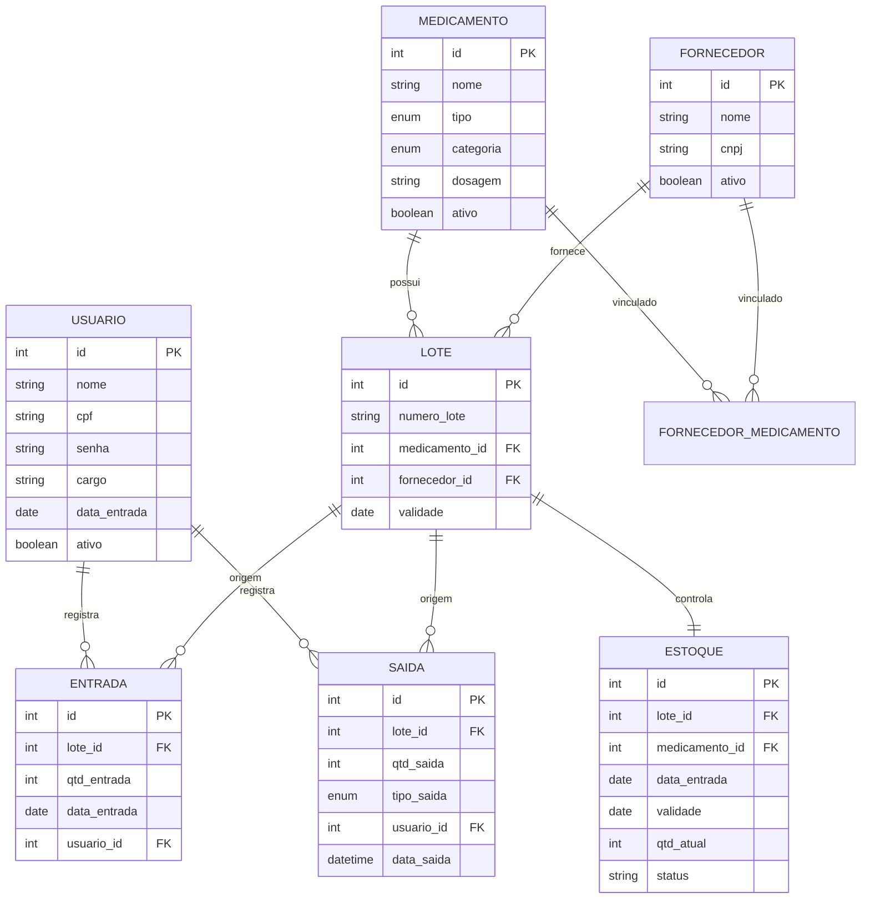

# SysFarm

Sistema desktop para gerenciamento de estoque de medicamentos, desenvolvido para controlar entradas, saídas e disponibilidade de produtos em farmácias e postos de saúde.

Projeto acadêmico desenvolvido no módulo de Projeto Integrador.

[](https://www.python.org/)
[](https://www.mysql.com/)
[](https://ttkbootstrap.readthedocs.io/)
[]()

---

## Índice

- [Sobre o projeto](#sobre-o-projeto)
- [Funcionalidades](#funcionalidades)
- [Arquitetura](#arquitetura)
- [Stack tecnológica](#stack-tecnológica)
- [Modelo de dados](#modelo-de-dados)
- [Regras de negócio](#regras-de-negócio)
- [Como executar](#como-executar)
- [Variáveis de ambiente](#variáveis-de-ambiente)
- [Estrutura de pastas](#estrutura-de-pastas)
- [Internacionalização](#internacionalização)
- [Roadmap](#roadmap)

---

## Sobre o projeto

O SysFarm centraliza o controle de medicamentos de ponta a ponta: cadastro de medicamentos e fornecedores, registro de entradas (recebimento de lotes) e saídas (vendas, avarias, perdas e roubos), com atualização automática do estoque por lote e indicação visual de quantidade baixa ou esgotada.

A aplicação é multiusuário, com autenticação por CPF e senha, e possui suporte nativo a dois idiomas (Português e Inglês) e a temas claro e escuro.

## Funcionalidades

| Módulo | Descrição |
|---|---|
| Autenticação | Login de usuários por CPF e senha, com validação de credenciais |
| Usuários | Cadastro, edição e exclusão de usuários do sistema, com cargo e data de entrada |
| Medicamentos | Cadastro de medicamentos com nome, tipo, categoria e dosagem, a partir de listas padronizadas |
| Fornecedores | Cadastro de fornecedores com nome e CNPJ |
| Entradas | Registro de recebimento de mercadoria, criando um novo lote vinculado a medicamento e fornecedor |
| Saídas | Baixa de quantidade de um lote, classificada como Venda, Avaria, Perda ou Roubo |
| Estoque | Visão consolidada de todos os lotes, com quantidade atual e status calculado automaticamente |
| Internacionalização | Toda a interface textual é centralizada e traduzida entre PT-BR e EN |
| Tema | Alternância entre tema claro e escuro |

## Arquitetura

O projeto segue o padrão MVC (Model-View-Controller), com uma camada adicional de DAO (Data Access Object) responsável por isolar todo o acesso ao banco de dados. As Views nunca acessam o banco diretamente; toda a comunicação passa pelo Controller correspondente.

```
        ┌───────────┐       ┌──────────────┐       ┌───────────┐       ┌───────────┐
        │   View    │  -->  │  Controller  │  -->  │    DAO     │  -->  │  MySQL    │
        │ (ttk/ctk) │ <--   │  (regras de  │ <--   │ (SQL puro) │ <--   │ Database  │
        └───────────┘       │   negócio)   │       └───────────┘       └───────────┘
                             └──────────────┘
                                    │
                                    ▼
                              ┌───────────┐
                              │  Models   │
                              │ (entidades)│
                              └───────────┘
```

Cada entidade do domínio (Usuário, Medicamento, Fornecedor, Lote, Entrada, Saída e Estoque) possui seu próprio conjunto de Model, DAO, Controller e View, o que mantém o código desacoplado e facilita a manutenção e a extensão do sistema.

## Stack tecnológica

| Camada | Tecnologia | Função |
|---|---|---|
| Linguagem | Python 3.12 | Lógica da aplicação |
| Interface gráfica | ttkbootstrap | Janelas de cadastro, login, entrada, saída e estoque |
| Interface gráfica | CustomTkinter | Menu principal com cards e imagens |
| Banco de dados | MySQL | Persistência dos dados |
| Conector | mysql-connector-python | Comunicação Python ↔ MySQL |
| Imagens | Pillow (PIL) | Carregamento de ícones e logos |
| Configuração | python-dotenv | Carregamento de credenciais via `.env` |

## Modelo de dados



Os scripts de criação de cada tabela estão disponíveis em [`app/migrations`](./app/migrations) e devem ser executados na ordem descrita na seção [Como executar](#como-executar).

## Regras de negócio

- Cada entrada gera (ou referencia) um lote, sempre vinculado a um medicamento, um fornecedor e um usuário responsável.
- Cada saída reduz a quantidade atual do lote em estoque e é classificada em um dos quatro tipos: Venda, Avaria, Perda ou Roubo.
- O status de cada lote em estoque é recalculado automaticamente a cada entrada ou saída, segundo a quantidade atual:

  | Quantidade | Status |
  |---|---|
  | 0 | Esgotado |
  | 1 a 19 | Baixo |
  | 20 ou mais | Disponível |

- Uma saída não pode ser registrada com quantidade maior do que a disponível no lote, nem com quantidade igual ou menor que zero.
- Registros de entrada não podem ser excluídos, preservando o histórico de movimentação do estoque.

## Como executar

### Pré-requisitos

- Python 3.12 ou superior
- MySQL Server em execução

### 1. Clonar o repositório

```bash
git clone https://github.com/leoozxs/SysFarm.git
cd SysFarm
```

### 2. Criar e ativar um ambiente virtual

```bash
python -m venv venv

# Windows
venv\Scripts\activate

# Linux/Mac
source venv/bin/activate
```

### 3. Instalar as dependências

```bash
pip install -r requirements.txt
```

### 4. Criar o banco de dados

Crie um banco no MySQL e execute os scripts de [`app/migrations`](./app/migrations) na ordem abaixo, respeitando as dependências de chave estrangeira:

1. `usuario.create.sql`
2. `medicamento.create.sql`
3. `fornecedor.create.sql`
4. `fornecedor_medicamento.create.sql`
5. `lote.create.sql`
6. `entrada.create.sql`
7. `saida.create.sql`
8. `estoque.create.sql`

### 5. Configurar as variáveis de ambiente

Veja a seção [Variáveis de ambiente](#variáveis-de-ambiente) abaixo.

### 6. Executar a aplicação

```bash
python main.py
```

## Variáveis de ambiente

Crie um arquivo `.env` na raiz do projeto com as credenciais de acesso ao banco:

| Variável | Descrição | Exemplo |
|---|---|---|
| `DB_HOST` | Endereço do servidor MySQL | `localhost` |
| `DB_PORT` | Porta do servidor MySQL | `3306` |
| `DB_NAME` | Nome do banco de dados | `sysfarm` |
| `DB_USER` | Usuário do banco | `root` |
| `DB_PASSWORD` | Senha do usuário | `sua_senha` |

O arquivo `.env` não deve ser versionado; ele já está incluído no `.gitignore` do projeto.

## Estrutura de pastas

```
SysFarm/
├── app/
│   ├── controllers/    Regras de negócio e orquestração entre view e dao
│   ├── views/           Telas construídas com ttkbootstrap e CustomTkinter
│   ├── dao/              Acesso ao banco de dados (CRUD de cada entidade)
│   ├── models/          Entidades do domínio
│   ├── core/              Conexão com o banco (database.py) e internacionalização (idioma.py)
│   └── migrations/    Scripts SQL de criação das tabelas
├── assets/                Ícones e logos utilizados na interface
├── main.py                 Ponto de entrada da aplicação
├── requirements.txt
└── .env                      Credenciais do banco (não versionado)
```

## Internacionalização

Todos os textos exibidos na interface são centralizados em `app/core/idioma.py`, organizados por chave (ex.: `usuario.cadastrado_sucesso`) e disponíveis em Português e Inglês. Isso permite adicionar um novo idioma sem alterar nenhuma tela, bastando incluir um novo dicionário de traduções.

## Roadmap

- [ ] Relatórios de movimentação de estoque por período
- [ ] Alertas de medicamentos próximos do vencimento
